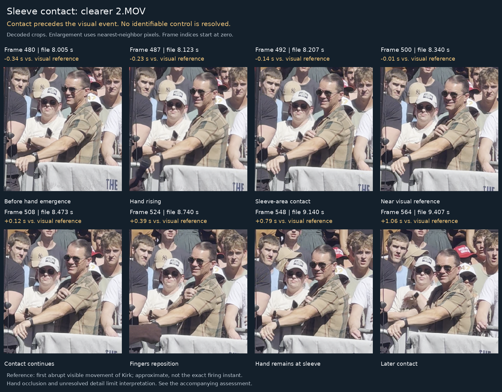
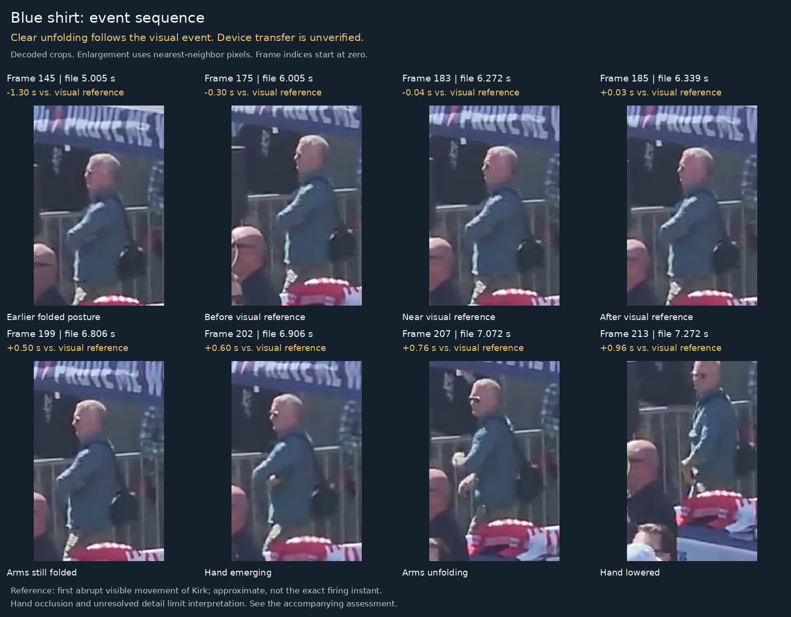
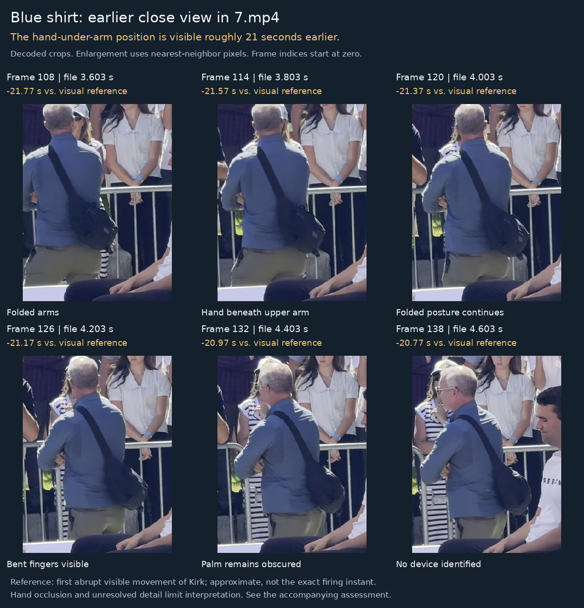

# Findings: movement and timing in four Kirk videos

**Result:** The clearer `2.MOV` confirms sleeve-area contact before Kirk's abrupt visible movement. The footage does not resolve an identifiable control at that contact. In `kirk2.mp4`, clear unfolding and hand emergence follow the visible event; a separate pre-event squeeze and device stowing remain unverified. `7.mp4` shows the hand-under-arm posture approximately 21 seconds earlier. These observations do not establish two coordinated device activations.

This is an exploratory review of particular files, not an authentication of camera originals or a determination of involvement in the killing. The men are described by clothing and location; their identities and employment were not independently established. The conclusions below are manual visual judgments, not results from a trained action-detection model or a blinded study.

## Sleeve contact: what the clearer file changes

The supplied `kirk1.mp4` displays at 270 × 480 pixels. The matching scene and sequence in [2.MOV](https://archive.org/download/kirkshooting/2.MOV) displays at 1080 × 1920 after rotation, supplying substantially more actual spatial detail. Both files contain 2,204 decoded frames, although their presentation timestamps are not identical. Matching content and metadata do not alone authenticate a camera original or prove the exact processing history.

In the clearer view, the man behind the barrier keeps his left arm extended and brings his right hand toward the left upper-arm/sleeve area. The hand becomes visible rising around 8.11–8.16 s; the fingers reach the sleeve area around 8.19–8.24 s. The approximate reference—the first clear abrupt visible movement of Kirk—is around 8.35 s. Contact therefore precedes that reference by roughly **0.1–0.2 seconds**. The hand remains at the sleeve area afterward, with the fingers repositioning in later frames.

The timing portion of the observation is supported: the contact is not simply a response to Kirk's already visible reaction. However, the frames do not resolve a button, a recognizable actuator, or a control changing state. They cannot establish that the gesture disguises another action. They also do not prove that it is an innocent scratch. **Confirmed contact; unresolved function** is the supported finding.

The initial estimate from the small upload was coarser. The final contact window above uses the clearer MOV and supersedes the preliminary estimate. The beginning of an arm movement hidden behind the body or barrier cannot be timed from first hand visibility alone.

## Blue shirt: squeeze versus subsequent unfolding

The supplied `kirk2.mp4` shows an already folded-arm posture. The relevant hand is largely hidden by the upper arm and torso. Minor contour changes cannot be identified confidently as squeezing a device: the object, its outline, and any actuator are unresolved.

The visual reference is approximately 6.31 s. Clear unfolding and hand emergence occur around 6.84–6.94 s, approximately **0.5–0.6 seconds afterward**. The hand then lowers toward the front/waist around 7.10–7.30 s.

A small bright detail is visible during emergence. It cannot reliably be separated into skin, highlight, cuff/accessory, or an identifiable held item. No object can be followed clearly and continuously from beneath the arm into a pocket or other storage location. **Hand lowering is visible; device stowing is unverified.** This is not a finding that the hand was empty, nor does post-event unfolding exclude every possible earlier, occluded small movement.

## Earlier context from 7.mp4

The close portion of [7.mp4](https://archive.org/download/kirkshooting/7.mp4) shows bent fingers beneath the folded upper arm around 3.6–4.6 s. Kirk's abrupt visible movement occurs around 25.37 s in this file. Thus, the hand-under-arm position appears roughly **21 seconds earlier**, not only immediately before the event.

This reduces the diagnostic value of that posture alone as a last-moment signal. It does not reveal what, if anything, is held in the obscured palm. The camera zooms out before the event, leaving the relevant hand too small or occluded to identify the alleged actuation. The preliminary approximately 19-second estimate was corrected after locating the visible event; an audio transient was not used as the final reference.

## Timing table

These are **file positions**, not authenticated real-world timestamps. Ranges are manual visual brackets, not statistical confidence intervals. Extra decimal places allow another reviewer to locate a frame.

| Source | Observation | Approximate file time | Relation to its own reference |
|---|---|---|---|
| 2.MOV | Right hand becomes visible rising | 8.11–8.16 s | Before |
| 2.MOV | Sleeve-area contact | 8.19–8.24 s | Roughly 0.1–0.2 s before |
| 2.MOV | First clear abrupt visible movement of Kirk | 8.32–8.38 s; representative marker 8.35 s | Reference |
| 2.MOV | Contact continues; fingers reposition | Examples through 9.4 s | After |
| kirk2.mp4 | First clear abrupt visible movement of Kirk | 6.272–6.339 s; representative marker 6.31 s | Reference |
| kirk2.mp4 | Clear unfolding/hand emergence | 6.84–6.94 s | Roughly 0.5–0.6 s after |
| kirk2.mp4 | Hand lowered toward front/waist | 7.10–7.30 s | Roughly 0.8–1.0 s after |
| 7.mp4 | Closer view of folded fingers | 3.6–4.6 s | Roughly 21 s before |
| 7.mp4 | First clear abrupt visible movement of Kirk | 25.32–25.42 s; representative marker 25.37 s | Reference |

The reference is neither the exact firing instant nor an independently measured bullet-impact instant. Recording speed, camera exposure, rolling shutter, edit history, sound propagation, and audio/video synchronization have not been fully established. Within-view ordering is stronger evidence here than exact millisecond claims. The two views were not used to claim independently verified synchronization.

## Source inventory and provenance

| Source | Display dimensions | Decoded frames | Video duration | Provenance in this review |
|---|---|---|---|---|
| kirk1.mp4 | 270 × 480 | 2,204 | 36.770 s | Supplied unchanged in the conversation |
| kirk2.mp4 | 720 × 1280 | 299 | 10.138 s | Supplied unchanged in the conversation |
| 2.MOV | 1080 × 1920 after rotation | 2,204 | 36.762 s | Downloaded from the user-identified archive |
| 7.mp4 | 1920 × 1080 | 1,176 | 39.207 s | Downloaded from the user-identified archive |

The [archive directory](https://archive.org/download/kirkshooting) lists `2.MOV` as 69.7M, last modified 28 October 2025 at 01:15, and `7.mp4` as 45.7M, last modified 11 September 2025 at 07:45. These archive dates do not establish recording dates or an unbroken chain of custody. Exact sizes, URLs, and SHA-256 values are recorded in `config/sources.json`; no source is accepted by the build if its bytes differ.

Metadata shows processing in the supplied MP4s. The MOV carries phone/camera-related metadata, which is preserved for inspection but is not independently authenticated. The second supplied file has an approximately 204 ms first presentation interval; this is outside the event window. The timestamp CSVs preserve variable intervals rather than replacing them with an assumed frame rate.

## What the review can and cannot settle

The package provides evidence for specific movements, their visible order, and the limitations of these views. It cannot turn ambiguous gestures into a defensible probability of an organized killing. No identifiable working device, communication, or causal link to the shooting is established in these files.

A clearer view of the blue-shirted man's hand during the event, identifiable equipment, several minutes of prior behavior, or independent communications/equipment records would materially help distinguish explanations. The current short views do not support a statistical claim that the gestures were unusually rare. A confirmed button press would still require evidence of the device's function and relevance.

## Method and reproduction

All source frames were enumerated with ffprobe. Overview sampling covered the clips, followed by detailed sequential inspection of the relevant windows. The script reproduces selected crops, three annotated boards, two muted slowed clips, and the visual report. Crop coordinates, source frame indices, and manual observation windows are explicit in `config/annotations.json`. No generative restoration, sharpening, or intermediate-frame synthesis is used. Standard decoding to RGB and display scaling are transformations; the original files remain unchanged.

The report distinguishes file timing from forensic timing in keeping with [SWGDE's frame timing guidance](https://www.swgde.org/documents/published-complete-listing/19-v-005-swgde-best-practice-for-frame-timing-analysis-of-video-stored-in-iso-base-media-file-formats/), which cautions about timing analysis of processed copies. This work is an exploratory review, not a claim of SWGDE-compliant forensic certification. See the README for exact commands and the audit directory for timestamps, checksums, annotations, and build versions.
